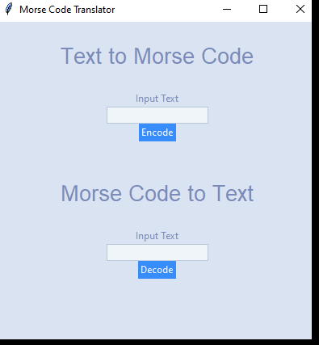

# Morse Code Application using Tkinter 




#### Introduction
- For this project I create a Morse Code Translator using Tkinter


#### Installation

- The libraries can be installed using the requirement file with the following code:
```pip install requirements.txt```

#### Usage

- The code can be used for translating & getting insights on how to use Tkinter library for an application

#### Details

- Create the dictionary with morse code & symbols
- Function to translate text to morse code
- Function to translate morse code to text
- Create the interface using Tkinter (main window, home screen, buttons, labels to display the output)


